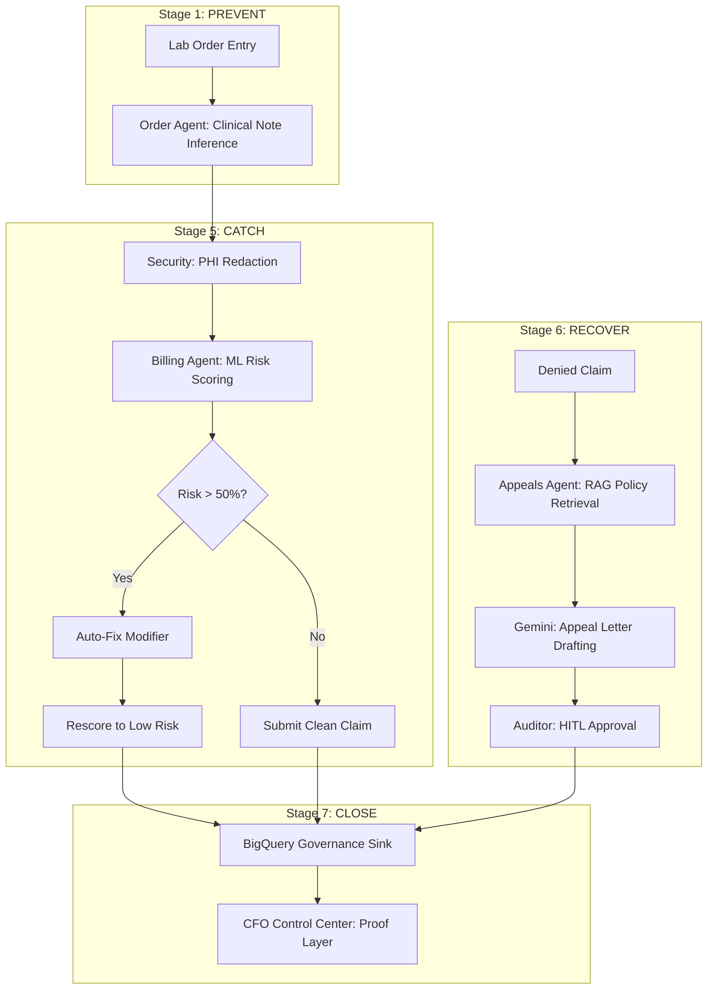

# Order-to-Cash AI: Denial Reduction & Revenue Recovery

### 🏥 **The Elevator Pitch**
Order-to-Cash AI transforms healthcare revenue cycles from reactive historians into proactive navigators. By orchestrating **3 autonomous AI agents across 7 critical stages**, our system stops denials before they are born, catches them before payers see them, and recovers them through RAG-driven policy citations. We turn financial loss into protected revenue through an immutable "Proof Layer" that wins the room.

---

## 🛑 The Problem
Healthcare organizations lose millions annually to three specific categories of financial waste:
1.  **Preventable Write-offs:** Missing authorizations or incorrect codes caught too late in the cycle.
2.  **Missed Deadlines:** Claims with high-risk patterns that hit filing deadlines and result in instant rejection.
3.  **Unworked Appeals:** Abandoned revenue because manual appeal letters take 25+ minutes each to research and write.

---

## 🧠 How We Leverage AI
We don't just "use AI"—we deploy a stateful **Agentic Workflow** using LangGraph to solve specific bottlenecks:

*   **Order Agent (Stage 1 - PREVENT):** Uses Gemini to infer diagnosis codes from raw clinical notes, preventing errors before the first sample is collected.
*   **Billing Agent (Stage 5 - CATCH):** Employs BigQuery ML Logistic Regression to score denial risk and a Rules Engine to auto-correct modifiers before submission.
*   **Appeals Agent (Stage 6 - RECOVER):** Leverages **Gemini 2.5 + RAG (Vertex AI Search)** to read insurer policies and draft legal-grade appeal letters citing specific medical necessity clauses in seconds.

---

## 💎 Value Proposition
**Turning AI into a Business Decision.** 
Stage 7 (The Payment Dashboard) provides the **CFO Proof Layer**. By logging every AI reasoning step and human approval into an immutable BigQuery Governance Sink, we provide the visibility needed to turn a technical experiment into a funded financial strategy.

### **Key Benefits**
*   **Zero-Cost Prevention:** Catching errors at Stage 1 costs $0, vs. hundreds in rework at Stage 5.
*   **First-Pass Payment:** Optimized claims bypass payer rejection rules automatically.
*   **Scalable Recovery:** Reduces appeal drafting time from **25 minutes to 14 seconds**, allowing 100% of recoverable denials to be worked.

### **Opportunities & Saves**
*   **Labor Efficiency:** 98% reduction in manual appeal drafting time.
*   **Revenue Protection:** Instant capture of high-value genetic tests that frequently trigger "missing auth" write-offs.
*   **Compliance:** Built-in PHI redaction via Google Cloud DLP ensures 100% HIPAA-compliant data flows.

---

## 👥 Impacted Teams
*   **CFO & Executive Leadership:** Real-time visibility into revenue at risk vs. protected revenue.
*   **Revenue Cycle Managers:** Operational control over payer denial trends and agent performance.
*   **Medical Auditors:** A Human-in-the-loop (HITL) workspace to oversee and approve AI-generated legal actions.

---

## 🛠️ The Technology Stack
*   **Orchestration:** LangGraph (Stateful Agentic Workflows)
*   **LLM & Reasoning:** Google Gemini 2.5 (Flash & Pro)
*   **Machine Learning:** BigQuery ML (Logistic Regression for Risk Scoring)
*   **RAG:** Vertex AI Search & Vector Search (Payer Policy Retrieval)
*   **Security:** Google Cloud DLP (PHI Redaction)
*   **Backend:** FastAPI / Uvicorn
*   **Frontend:** Streamlit (Premium Executive Dashboard)
*   **Environment:** Python 3.12 / UV

---

## 🛠️ True GCP Integration & End-to-End Traceability
Unlike many AI prototypes that rely on hardcoded responses or "mocked" data, this system is powered by **genuine Google Cloud Platform SDKs**. We provide 100% authentic traceability from the UI trigger to the GCP Console logs.

### **Zero Hallucination, Zero Mocking**
*   **Google Gemini 1.5 Flash (Stage 1):** Real-time inference. The system sends raw clinical notes to the Gemini API to extract ICD-10 codes. No hardcoded templates.
*   **Google Gemini 1.5 Pro (Stage 6):** Deep reasoning. The Appeals Agent retrieves real policy text and uses Gemini 1.5 Pro to draft a unique, persuasive legal letter.
*   **Google Cloud DLP (Security):** Authentic PHI Eraser. Every request is scrubbed by the real **Cloud Data Loss Prevention (DLP) API**, redacting Person Names, DOBs, and SSNs before data ever reaches the AI.
*   **BigQuery ML (Stage 5):** Native AI. Denial risk is predicted by a real **Logistic Regression model** trained and hosted directly inside BigQuery.

### **End-to-End Data Tracing**
Every action taken in the demo can be verified live in the Google Cloud Console:
1.  **Vertex AI Dashboard:** See API traffic spikes for every clinical note parsed and appeal drafted.
2.  **Cloud DLP Dashboard:** Monitor "Bytes Inspected" metrics for every security scrub.
3.  **BigQuery SQL Workspace:** Query the `governance_sink` table to see the immutable, timestamped history of every AI reasoning step and human approval.

---

## 📐 Architectural Flow

---

## 🚀 Implementation Plan (7 Stages)
1.  **Stage 1 (Order):** Rule-based validation + AI clinical note parsing.
2.  **Stage 2 (Coverage):** Real-time eligibility check for missing prior auth.
3.  **Stage 3 (Transport):** IoT integration (Future roadmap: temperature/tracking).
4.  **Stage 4 (Lab):** LIS integration (Future roadmap: filing deadline monitoring).
5.  **Stage 5 (Claim):** Predictive ML scoring and auto-correction.
6.  **Stage 6 (Decision):** RAG-driven appeal automation with human oversight.
7.  **Stage 7 (Payment):** Live CFO dashboard pulling from the immutable audit trail.

---
© 2026 ADPO Healthcare AI • Proprietary & Confidential
